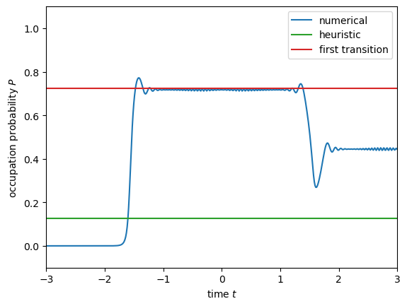

# 目的
```math
P
\rightarrow 4 \exp \left(-4 \frac{\omega}{|\omega|} \mathrm{Im} \int_0^{t_1} dt E'_+  \right) \left( 1 - \exp \left( -4 \frac{\omega}{|\omega|} \mathrm{Im} \int_0^{t_1} dt E'_+  \right) \right) \cos^2 \left(-\frac{\omega}{|\omega|} \int_{t_4}^{t_1} dt E'_+ + \varphi_s \right)
```
を導出します。

# 計算
## Hamiltonianのユニタリ変換
Hamiltonian
```math
\begin{align*}
H(t)
&= B_x \,\sigma_x + B_y \,\sigma_y + B_z \,\sigma_z\\
&\equiv \boldsymbol{B} \cdot \boldsymbol{\sigma} 
\end{align*}
```
に対して，ユニタリ行列
```math
U(t)
=
\begin{pmatrix} 
    \exp(-\frac{1}{2} \phi(t)) & 0\\
    0 & \exp(\frac{1}{2} \phi(t))\\
\end{pmatrix}
```
を用いたユニタリ変換を行うと，
```math
\begin{align*}
    H'(t)
    &= U^{\dagger} H U - i U^{\dagger} \frac{\partial}{\partial t} U
    &= \sqrt{B_x^2 + B_y^2} \, \sigma_x + \left( B_z - \frac{1}{2} \omega \dot{\phi} \right) \, \sigma_z\\
    &\equiv B'_x \, \sigma_x + B'_z \, \sigma_z\\
    &= \boldsymbol{B}' \cdot \boldsymbol{\sigma}
\end{align*}
```
と表せます。

## 遷移確率
```math
|\psi(t) \rangle
= \sum_{\alpha = \pm} A_{\alpha}(t) \exp \left( -i \int_0^t d\tau E'_{\alpha}(\tau) \right) | \psi_{\alpha}(t) \rangle
```
をShrödinger方程式に代入すると，遷移振幅についての連立微分方程式
```math
\left\{ \,
    \begin{align*}
        \dot{A_+}(t)
        &= - \langle \psi_+ | \dot{\psi_-} \rangle A_-(t) \exp \left( i \int_0^t d\tau 2 E'_+(\tau)\right) \\
        \dot{A_-}(t)
        &= - \langle \psi_- | \dot{\psi_+} \rangle A_+(t) \exp \left( -i \int_0^t d\tau 2 E'_+(\tau) \right)
    \end{align*}
\right.
```
が得られます。ここで，$`A_-(t) \approx 1`$ (断熱近似) を仮定すると，遷移振幅についての積分
```math
A_+(t_f)
= \int_{t_i}^{t_f} dt \frac{1}{2 (E'_+)^2 |B'_x|}\left( [\boldsymbol{B}'\times (\boldsymbol{B}'\times \dot{\boldsymbol{B}'})]_z \right) \exp \left(i \int_0^t d\tau 2 E'_+ \right)
```
に帰着します。この積分は断熱エネルギーの零点に由来する留数の総和
```math
A_+(t_f)
\approx 2\pi i (\mathrm{Res}(t_1) + \mathrm{Res}(t_4))
```
で表せます。$`\varepsilon_0 \gg \Delta_z`$，$`\varepsilon_0^2 \gg \Delta_z \Delta_y`$という条件のもとで，
```math
\begin{align*}
    A_+(t_f)
    &\approx \frac{\pi}{3} (e^{\mathrm{Im}\beta_1+i\mathrm{Re} \beta_1} - e^{\mathrm{Im}\beta_4+i\mathrm{Re} \beta_4} )\\
    &= \frac{\pi}{3} e^{-\mathrm{Im} \beta_1}e^{i \frac{\mathrm{Re} \beta_1 + \mathrm{Re} \beta_4}{2}} 2 i \sin \left( \frac{\mathrm{Re}\beta_1 - \mathrm{Re}\beta_4}{2} \right)
\end{align*}
```
と書けるため，double-passage TLZモデルの遷移確率は，
```math
\begin{align*}
P
= |A_+(t_f)|^2
&\approx 4 e^{-2 \mathrm{Im} \beta_1} \sin^2 \left( \frac{\mathrm{Re} \beta_1 - \mathrm{Re} \beta_4}{2} \right)\\
&= 4 \exp \left( -4 \frac{\omega}{|\omega|} \mathrm{Im} \int_0^{t_1} dt E'_+ \right) \cos^2 \left( \frac{\omega}{|\omega|} \int_{t_4}^{t_1} dt E'_+  \right)
\end{align*}
```
で与えられます。Stückelberg公式に倣って，非断熱領域への拡張を行うと，
```math
P
\rightarrow 4 \exp \left(-4 \frac{\omega}{|\omega|} \mathrm{Im} \int_0^{t_1} dt E'_+  \right) \left( 1 - \exp \left( -4 \frac{\omega}{|\omega|} \mathrm{Im} \int_0^{t_1} dt E'_+  \right) \right) \cos^2 \left(-\frac{\omega}{|\omega|} \int_{t_4}^{t_1} dt E'_+ + \varphi_s \right)
```
が得られます。

## Stokes位相$`\varphi_s`$
一般に (?)，断熱パラメータ
```math
\delta
= \frac{1}{2 \pi} \mathrm{Im} \int_{r_-}^{r_+} (k_- - k_+) dr \\
= \frac{1}{\pi} \mathrm{Im} \int_R^{r_+} (k_- - k_+) dr
```
に対して，
```math
\varphi_s
= \frac{\pi}{4} + \delta (\ln \delta -1) + \mathrm{Arg} \, \Gamma (1 - i\delta)
```
という関係式が成立します (Child, 1974)。

## 数値計算との比較
以上の結果を数値計算と比較したのが，`Oka_Dykhne_double_passage.py`です。

出力例)



ここで，青実線はShrödinger方程式を数値的に解いた時の占有確率，緑実線は上で求めた遷移確率を表しています。青実線と緑実線は，終時間 (time = 3) で一致するはずですが，図を見るとそうなっていません。何か見落としている位相があるのかもしれません。