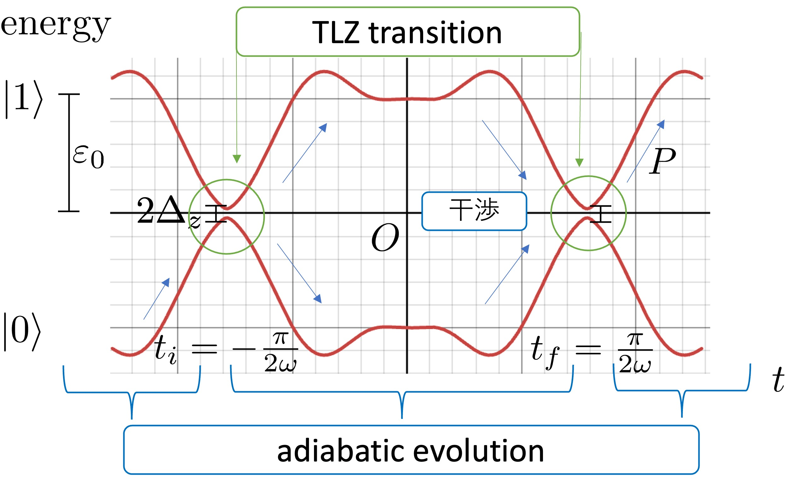

# multiple-passage twisted Landau-Zenerモデル

Hamiltonian
```math
H_\mathrm{MTLZ}(t)
=
\begin{pmatrix}
\Delta_z \sin \omega t & -\varepsilon_0 \cos \omega t + i \frac{1}{2} \Delta_y \sin^2 (2 \omega t)\\
-\varepsilon_0 \cos \omega t - i \frac{1}{2} \Delta_y \sin^2 (2 \omega t) & -\Delta_z \sin \omega t
\end{pmatrix}
```
をmultiple-passage Landau-Zenerモデルと呼びます。

## 図1 断熱エネルギーの時間発展

<br>

## 他のモデルとの関係
### 特別な場合
| 条件 | 一致するモデル |
| --- | ------------ |
|$`\Delta_y = 0`$|[multiple-passage Landau-Zenerモデル](mpLZ.md.md)|
|$`t = n \pi/2\omega \, (n \in \mathbb{N})`$近傍で展開|[twisted Landau-Zenerモデル](TLZ.md)|

#### 参考) 最高次までのTaylor展開の表

| 関数 | $`x = -\frac{\pi}{2}`$ | $`x = \frac{\pi}{2}`$
| -- | -- | -- |
| $`\sin(x)`$ | $`-1`$ | $`1`$
| $`\cos(x)`$ | $`\left(x + \frac{\pi}{2} \right)`$| $`- \left(x - \frac{\pi}{2} \right)`$
| $`\sin^2(2x)`$ | $`4 \left(x - \frac{\pi}{2} \right)^2`$ | $`4 \left(x + \frac{\pi}{2} \right)^2`$
