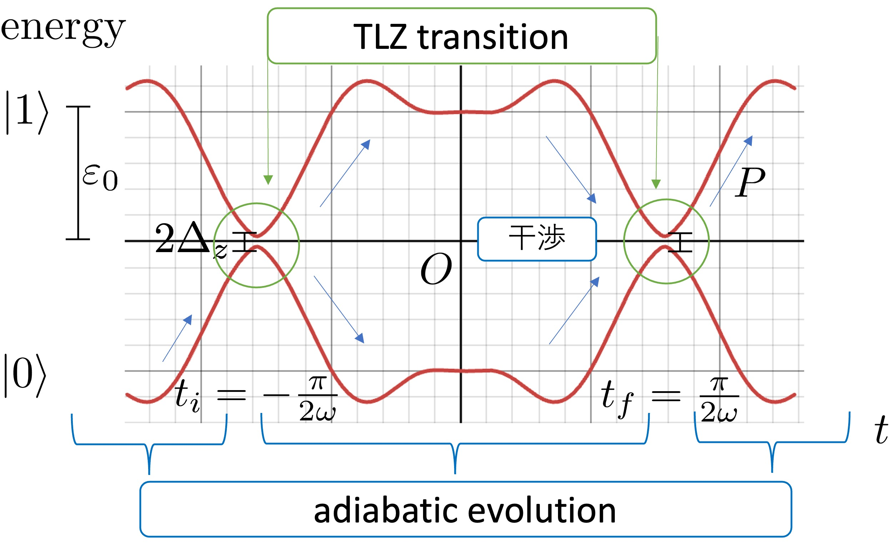

# このレポジトリについて
量子力学の2状態系における占有確率を出力するプログラムが含まれます。

# 各プログラムの説明
## Oka_Dykhne.py
これはtwisted Landau-ZenerモデルのHamiltonianを用いて，Lim, Fuchs and Montambaux (2015) の論文の遷移確率
```math
P = \exp \left(-\frac{4}{|w|} \int_0^{\mathrm{Im} t_c} dv \mathrm{Re} (E|_{t=\mathrm{Re} t_c + iv}\right)
```
を算出したとき，完全トンネルが見られることを確かめるためのプログラムです。ただし、ゼロ点のみ遷移点近傍で近似しています。

## Oka_Dykhne_v_evaluate.py
Oka_Dykhne.pyで$`F`$を固定して$`\nu`$を変化させるプログラムです。energy slope $`\nu`$を横軸、遷移確率$`P`$を縦軸にしたグラフを出力します。<br>
twisted Landau-ZenerモデルのHamiltonianにおいて、$`\nu`$を変化させることと$`F`$を変化させることは等価であるため、Oka_Dykhne.pyと見かけ上まったく同じグラフになります。ただし解釈はそれぞれ異なります。$`\nu`$, $`F`$の符号反転はそれぞれ、時間反転、エネルギー反転に対応します。

## Oka_Figure1_c.py
これはTakayoshi, Wu and Oka (2021) のFigure1 (c)を再現するプログラムです。任意のHamiltonianで試すことができます。

## Oka_Dykhne_Kondo.py
multiple-passage Twisted Landau-ZenerモデルのHamiltonianを用いて，
Lim, Fuchs and Montambaux (2015) の遷移確率
```math
P = \exp \left(-\frac{4}{|\delta|} \int_0^{\mathrm{Im} t_c} dv
     \mathrm{Re} (E|_{t=\mathrm{Re} t_c + iv}) \right)
```
($`\delta:`$ 断熱パラメータ) を算出したとき，完全トンネルが見られることを確かめるためのプログラムです。
このプログラムでは、掃引速度$`F`$を横軸、遷移確率$`P`$を縦軸にしたグラフを出力します。
ただし、断熱エネルギーのゼロ点の虚部$`\mathrm{Im} \, t_c`$のみ遷移点近傍で近似した表式を使っています。

## Oka_Dykhne_Kondo_e_evaluate.py
Oka_Dykhne_kondo.pyで$`F`$を固定して $`\nu`$ を変化させるプログラムです。energy slope $`\nu`$を横軸、遷移確率$`P`$を縦軸にしたグラフを出力します。$`\nu`$, $`F`$の符号反転はそれぞれ、時間反転、エネルギー反転に対応します。
- 現状Integration Warningが出ます。→調査中

## Oka_Dykhne_Kondo_e_evaluate_symmetry.py
遷移点付近のHamiltonianがすべて同じになる系の場合で下記を実現します。Oka_Dykhne_kondo.pyで$`F`$を固定して$`\nu`$を変化させるプログラムです。energy slope $`\nu`$を横軸、遷移確率$`P`$を縦軸にしたグラフを出力します。$`\nu`$, $`F`$の符号反転はそれぞれ、時間反転、エネルギー反転に対応します。
- 現状Integration Warningが出ます。→調査中

## Oka_Dykhne_double_passage.py
Oka(2021)をもとにユニタリ変換後のHamiltonianで占有確率を数値計算するプログラムです。
```math
\Delta_x \sin{\omega t} \sigma_x
+ \Delta_y \cos{\omega t} \sin{2 \omega t}\sigma_y
+ \varepsilon_0 \cos{\omega t} \sigma_z
```
に対してユニタリ変換します。

## TLZ_time_evolution.py
これはTakayoshi, Wu and Oka (2021) のTwisted Landau-Zenerモデルについて、Shr&ouml;dinger方程式の数値微分を行うことで、占有確率の時間発展をプロットするプログラムです。初期状態がlower stateのとき、upper stateの占有確率を求めます。

# Hamiltonian
本レポジトリで登場するHamiltonianの一覧です。
## twisted Landau-Zenerモデル
```math
H_\mathrm{TLZ}(t)
=
\begin{pmatrix}
\Delta_z & \varepsilon_0 \omega t - i \frac{1}{2} \Delta_y (\omega t)^2\\
\varepsilon_0 \omega t + i \frac{1}{2} \Delta_y (\omega t)^2 & \Delta_z
\end{pmatrix} 
```
- 特に$`\Delta_y = 0`$のとき，Landau-Zenerモデルと呼びます。

## multiple-passage twisted Landau-Zenerモデル
```math
H_\mathrm{MTLZ}(t)
=
\begin{pmatrix}
\Delta_z \sin \omega t & -\varepsilon_0 \cos \omega t + i \frac{1}{2} \Delta_y \sin^2 (2 \omega t)\\
-\varepsilon_0 \cos \omega t - i \frac{1}{2} \Delta_y \sin^2 (2 \omega t) & -\Delta_z \sin \omega t
\end{pmatrix}
```
- 特に$`\Delta_y = 0`$のとき，multiple-passage Landau-Zenerモデルと呼びます。<br>
- このモデルは，$`t = n \pi/2\omega \, (n \in \mathbb{N})`$近傍でtwisted Landau-Zenerモデルとみなすことができます。

### 参考) 最高次までのTaylor展開の表

| 関数 | $`x = -\frac{\pi}{2}`$ | $`x = \frac{\pi}{2}`$
| -- | -- | -- |
| $`\sin(x)`$ | $`-1`$ | $`1`$
| $`\cos(x)`$ | $`\left(x + \frac{\pi}{2} \right)`$| $`- \left(x - \frac{\pi}{2} \right)`$
| $`\sin^2(2x)`$ | $`4 \left(x - \frac{\pi}{2} \right)^2`$ | $`4 \left(x + \frac{\pi}{2} \right)^2`$

### 図1 断熱エネルギーの時間発展

<br>

# 変数間の関係
このレポジトリでは，同じ物理量に対して異なる変数が混在しています。変数間の対応関係は以下を参照してください。

```math
\begin{align*}
\text{minimal energy gap} &: m \leftrightarrow \Delta_z \\
\text{energy slope} &: \nu \leftrightarrow \varepsilon_0 \\
\text{geodesic curvature} &: k \leftrightarrow \frac{4 \Delta_y}{\varepsilon_0^2} \\
\text{sweep speed} &: F \leftrightarrow -\omega
\end{align*}
```


# 参考文献
- L. Lim, J. Fuchs and G. Montambaux, Phys. Rev. A **91**, 042119 (2015).
- M. V. Berry, Proc. R. Soc. Lond. A **430**, 405 (1990).
- Y. Kayanuma, Phys. Rev. A **55**, 2495 (1997).
- S. Takayoshi, J. Wu and T. Oka, SciPost Phys. **11**, 075 (2021).

# .pyファイルを.ipynbのように扱う
本レポジトリ内の.pyファイルは，
```python
# %%
```
および
```python
# %%[markdown]
```
を用いて，.ipynbファイルの操作感でプログラムを実行できるようにしています。